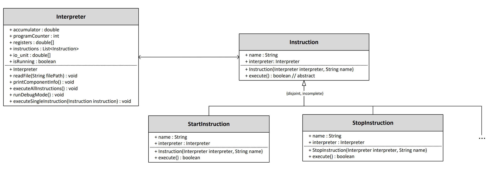

<h1 align="center">HAL</h1>

A small Assembly-like Interpreter written in Java

<h1 align="center">Instructions</h1>

| Name        | Operand     | Description         |
| ----------- | ----------- | ------------------- |
| START       |             | Start program       |
| STOP        |             | Stop  program       |
| ADD         | r           | Add content of register r to accumulator (acc += registers[r]) |
| SUB         | r           | Subtract accumulator with content of register r (acc -= registers[r]) |
| MUL         | r           | See ADD and SUB     |
| DIV         | r           | See ADD and SUB     |
| ADDNUM      | n           | Add the number n to accumulator (acc += n) |
| SUBNUM      | n           | Subtract the number n from the accumulator (acc -= n) |
| MULNUM      | n           | See ADDNUM and SUBNUM |
| DIVNUM      | n           | See ADDNUM and SUBNUM |
| OUT         |             | write content of accumulator into input/output-unit |
| IN          |             | read the from input/output-unit and write content into accumulator |
| LOAD        | r           | Load content of register r into accumulator (acc = registers[r]) |
| LOADNUM     | n           | Load number n into accumulator (acc = n) |
| STORE       | r           | Save accumulator into register registers[r] = acc |
| JUMP        | a           | Jump to program adress a |
| JUMPPOS     | a           | Jump to program adress a, if acc is negative |
| JUMPNEG     | a           | Jump to program adress a, if acc is positive |
| JUMPNULL    | a           | Jump to program adress a, if acc is 0 |

<h1 align="center">UML Class Diagram</h1>

